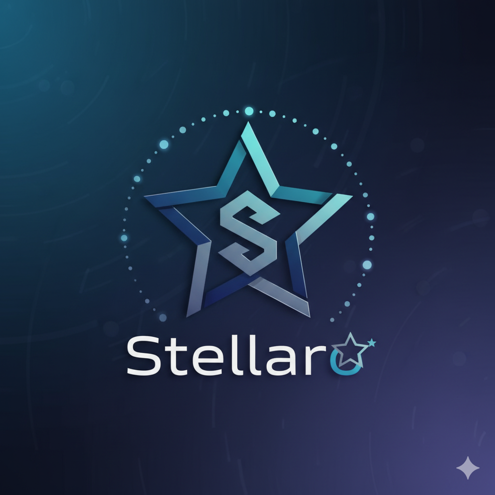
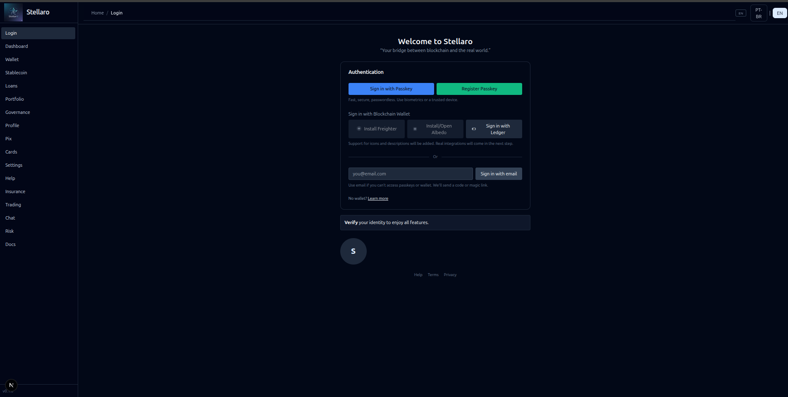
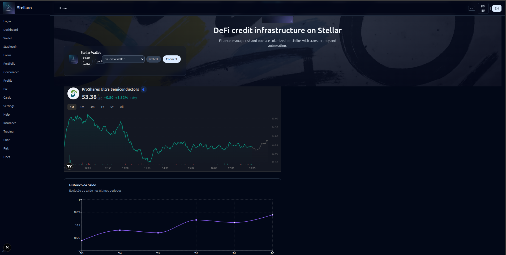

<div align="center">
  
  
  # Stellaro DeFi Credit Infrastructure on Stellar
  
  *Infraestrutura DeFi de Crédito na Stellar*
</div>

Welcome to the Stellaro project! This monorepo contains the complete architecture for a DeFi credit infrastructure platform built on Stellar, featuring a Next.js 15 frontend, NestJS backend, AI-powered risk management (ElizaOS), and enterprise-grade integrations for Stellar/Soroban, PIX, Cards, KYC, and Passkeys.

Bem-vindo ao projeto Stellaro! Este monorepo contém a arquitetura completa para uma plataforma de infraestrutura DeFi de crédito construída na Stellar, com frontend Next.js 15, backend NestJS, gerenciamento de risco com IA (ElizaOS), e integrações enterprise para Stellar/Soroban, PIX, Cartões, KYC e Passkeys.

## 🎨 Screenshots da Interface

Login / Autenticação:



Home / Dashboard:



## 🎯 Architecture v3.0 Highlights

- **🤖 AI Risk Guardian** - ElizaOS-powered risk assessment with ZK-proof credit scoring
- **⚡ Sub-second Oracles** - Reflector Network integration (<500ms latency)
- **🔐 Passkey Sessions** - Biometric authentication with session keys for batch operations
- **💰 120% Collateralization** - Automated reserve monitoring with emergency freeze
- **🏗️ Production-Ready Infrastructure** - AWS EKS, PostgreSQL Multi-AZ, Redis cluster
- **📊 Progressive Decentralization** - Multisig 3/5 → DAO governance roadmap

## Features / Funcionalidades

### Core Features / Funcionalidades Principais
- 🏦 **DeFi Credit Infrastructure** - Complete lending and borrowing platform with AI-powered risk assessment
- 💳 **Stablecoin STLT-BRL** - Brazilian Real-pegged stablecoin with 120%+ collateralization
- 🏛️ **Governance System** - Progressive decentralization (Multisig → DAO)
- 🔐 **Wallet Integration** - Freighter, Ledger, Albedo support
- 📱 **PIX Integration** - Instant BRL mint/burn via Stellar Anchors
- 🎯 **KYC/AML Compliance** - Multi-tier (0/1/2) via Onfido + Chainalysis
- 🔒 **Security Features** - Passkey authentication, session keys, reserve monitoring
- 🤖 **AI Risk Agent** - ElizaOS Stellaro (risk) with ZK credit scoring (Groth16)
- ⚡ **Sub-500ms Oracles** - Reflector Network + Stellar DEX fallback

### Novos Endpoints On-Chain (Backend)
- `GET /oracles/price?asset=<code>&issuer=<account>`: preço agregado em tempo real (Reflector + DEX fallback)
- `GET /defi/blend/positions/:address`: posições DeFi enriquecidas por saldo Horizon + preço oracle, com
  - `poolId`: de `LOANS_POOL_CONTRACT_ID`
  - `apy`: lido dinamicamente via `params()` do LoansPool (fallback env: `LOANSPOOL_INTEREST_BPS` em bps → %)
  - cache Redis: 15s (evita sobrecarga)
  - cache de params: 5min em memória
- `GET /memory/history/:address?cursor=<id>`: histórico de operações do endereço via Horizon com paginação por cursor

### Compliance & Reserve Management
- `GET /compliance/reserves/check`: verifica colateralização atual (120% mínimo)
- `POST /compliance/reserves/proof`: gera Proof of Reserves on-chain
- `GET /compliance/reserves/snapshot`: snapshot detalhado de reservas
- Integração completa com Soroban:
  - Leitura de `total_supply` do contrato Stablecoin
  - Freeze automático de minting via `set_mint_enabled(false)` em caso de undercollateralization
- Sistema de notificações multi-canal (webhook, email, console)

### Autenticação WebAuthn (Passkey)
- `POST /auth/passkey/register/init`: inicializar registro de passkey
- `POST /auth/passkey/register/verify`: verificar attestation e completar registro
- `POST /auth/passkey/login/init`: inicializar login com passkey
- `POST /auth/passkey/login/verify`: verificar assertion e emitir tokens
- `POST /auth/webauthn/attestation`: verificação direta de attestation
- `POST /auth/webauthn/assertion`: verificação direta de assertion
- Integração production-ready com PasskeyService (Redis-backed)
- Suporte a MFA e transaction signing

Quick tests:
```bash
curl "http://localhost:3001/oracles/price?asset=USDC&issuer=GD..."
curl "http://localhost:3001/defi/blend/positions/GD..."
curl "http://localhost:3001/memory/history/GD...?cursor=now"
curl "http://localhost:3001/compliance/reserves/check"
```

### Tech Stack v3.0
- **Frontend**: Next.js 15, React 19, TypeScript, Tailwind CSS, Zustand, next-intl
- **Backend**: NestJS 11, Prisma (PostgreSQL), Redis Cluster, Swagger/OpenAPI
- **Blockchain**: Stellar, Soroban Smart Contracts (Rust)
- **AI/ML**: ElizaOS (Anthropic Claude), ZK-Proofs (Groth16)
- **Infrastructure**: AWS EKS (sa-east-1), PostgreSQL Multi-AZ, Redis cluster
- **CI/CD**: GitHub Actions, Turborepo, Docker, Kubernetes
- **Monitoring**: Grafana, Prometheus, Loki, CloudWatch
- **Security**: Passkey Kit, Onfido, Chainalysis, Wazuh SIEM

## Project Structure / Estrutura do Projeto

- **`apps/frontend`**: Next.js 14 application with modern UI components and wallet integration.
  - *Aplicação Next.js 14 com componentes de UI modernos e integração de carteira.*
- **`apps/backend`**: NestJS application with Prisma, Redis, and comprehensive API services.
  - *Aplicação NestJS com Prisma, Redis e serviços de API abrangentes.*
  - Endpoints relevantes: `/oracles/price`, `/defi/blend/positions/:address`, `/memory/history/:address`, `/chain/health`
- **`contracts/`**: Soroban smart contracts written in Rust for DeFi operations.
  - *Contratos inteligentes Soroban escritos em Rust para operações DeFi.*
- **`packages/`**: Shared UI components and configurations across the monorepo.
  - *Componentes de UI compartilhados e configurações em todo o monorepo.*
- **`infra/`**: Docker files, deployment scripts, and CI/CD configurations.
  - *Arquivos Docker, scripts de deploy e configurações de CI/CD.*

## Deployed Smart Contracts / Contratos Inteligentes Deployados

The Stellaro platform includes 6 core smart contracts deployed on Stellar Testnet:

A plataforma Stellaro inclui 6 contratos inteligentes principais deployados na Stellar Testnet:

| Contract / Contrato | Contract ID | Purpose / Propósito |
|-------------------|-------------|-------------------|
| **Stablecoin** | `CA2QGUHYWINO4JYADA3P4CUJC25DSMM6LPOYVFM63T5VFHGMDF3JQITA` | STLT token management and transfers |
| **RiskLock** | `CAKSLX55PXBULHZ4W4Z5VGAE35J3OUF3VUCG7IL22LTN3DTGMVNQIQFB` | Risk management and account locking |
| **LoansPool** | `CC2NDM5ZPXNET6LUVKKBUAAO75MMP2ISJWKF27X6WWJVC4HD3HU7344M` | Lending and borrowing operations |
| **Portfolio** | `CCI4AQ3LMYJYTNNU2354VJ37EIC3SKV2UBXDMIA4OLPINOI6ZSOPNRKP` | Asset portfolio management |
| **Governance** | `CA47ANKVNAFNO4EOCC3S3EJ2HKQ5DR4X55QQQ5ETCLKWXF76G5M5JBGF` | DAO governance and voting |
| **ZK Verifier** | `CDJX3YLVANLTRRMMWDJO6NG7ADKJIHPL3WJAZNMNL6BQU6S6D5QXBT3L` ✅ | ZK-proof verification and credit scoring (initialized) |

### Network Configuration / Configuração da Rede
- **Network**: Stellar Testnet
- **RPC URL**: `https://soroban-testnet.stellar.org`
- **Horizon URL**: `https://horizon-testnet.stellar.org`
 - **Admin (Public Key)**: `GDHIZHAWV7TC6RKI2KXQ23XVRQ23UPJWSODCQHIRZQO22ANVGH7BM4ZD`

### Variáveis de Ambiente (Backend)
- `HORIZON_URL`, `SOROBAN_RPC_URL`
- `BACKEND_URL` e/ou `BACKEND_PUBLIC_URL`
- `LOANS_POOL_CONTRACT_ID` (usado para `poolId` nas posições)
- `LOANSPOOL_INTEREST_BPS` (usado para `apy` nas posições)
- `PORTFOLIO_CONTRACT_ID` (opcional)

### Deploying Contracts / Deployando Contratos

To deploy or update the smart contracts, use the automated deployment script:

Para fazer deploy ou atualizar os contratos inteligentes, use o script de deploy automatizado:

```bash
# Build contracts (release)
soroban contract build --profile release

# Fund account on testnet (if needed)
curl "https://friendbot.stellar.org/?addr=<ADMIN_PUBKEY>"

# Deploy with default settings / Deploy com configurações padrão
./infra/deploy_soroban.sh deploy

# Deploy with custom parameters / Deploy com parâmetros customizados
./infra/deploy_soroban.sh deploy <ADMIN_PUBKEY> <RISK_BPS> <LTV_BPS> <INTEREST_BPS>
```

**Prerequisites / Pré-requisitos:**
- `soroban-cli` installed and configured
- Rust target `wasm32v1-none` added
- Stellar account imported with alias
 - `.env-dev` configured with CONTRACT_IDs (auto-populated pelo script)

> Referência de deploy: consulte `TESTNET_DEPLOY.md` e `DEPLOY_SUCCESS.md` para detalhes, IDs e links de explorer.

## Documentation / Documentação

**📚 Comprehensive documentation for v3.0 architecture:**

- **[Quick Start Guide](./QUICK_START.md)** - Week 1 implementation guide
- **[Architecture Decision Records](./docs/ADRs.md)** - Technical decisions and rationale
- **[Week 1 Report](./docs/WEEK1_REPORT.md)** - Implementation status and metrics
- **[English Manual](./docs/Manual.EN.md)** - Complete user and developer guide
- **[Manual em Português](./docs/Manual.pt-BR.md)** - Guia completo em português

### Key Features Documentation

| Feature | Status | Documentation |
|---------|--------|---------------|
| Reflector Oracle | ✅ Implemented | `src/oracles/reflector-oracle.service.ts` |
| Passkey Sessions | ✅ Implemented | `src/passkey/passkey-session.service.ts` |
| Reserve Manager | ✅ Implemented | `src/compliance/reserve-manager.service.ts` |
| CI/CD Pipeline | ✅ Implemented | `.github/workflows/ci.yml` |
| Kubernetes Setup | ✅ Implemented | `infra/k8s/` |
| ZK Credit Score | 🔄 In Progress | Week 3-4 |
| PIX Integration | 📅 Planned | Week 5-6 |

## Getting Started / Começando

### Prerequisites / Pré-requisitos
- Node.js 20+
- npm 10+
- Docker & Docker Compose
- Rust toolchain (stable)
- Stellar CLI 23.0.0+
- PostgreSQL 15+ (or use Docker)

### Quick Setup / Configuração Rápida

1.  **Clone the repository / Clone o repositório**:
    ```bash
    git clone https://github.com/Jistriane/Stellaro.git
    cd Stellaro
    ```

2.  **Install dependencies / Instale as dependências**:
    ```bash
    npm install
    ```

3.  **Start infrastructure / Inicie a infraestrutura**:
    ```bash
    # PostgreSQL + Redis via Docker
    docker run -d --name stellaro-postgres \
      -e POSTGRES_USER=stellar -e POSTGRES_PASSWORD=dev \
      -e POSTGRES_DB=stellaro_dev -p 5432:5432 postgres:15-alpine

    docker run -d --name stellaro-redis -p 6379:6379 redis:7-alpine
    ```

4.  **Configure environment / Configure o ambiente**:
    ```bash
    cd apps/backend
    cp .env.example .env
    # Edit .env with your credentials
    ```
    Campos importantes a ajustar:
    - `HORIZON_URL`, `SOROBAN_RPC_URL`
    - `LOANS_POOL_CONTRACT_ID`, `LOANSPOOL_INTEREST_BPS`

5.  **Run migrations / Execute migrations**:
    ```bash
    npx prisma migrate dev
    npx prisma generate
    ```

6.  **Deploy contracts / Faça deploy dos contratos**:
    ```bash
    ./infra/deploy_soroban.sh testnet
    ```

7.  **Start development / Inicie desenvolvimento**:
    ```bash
    npm run dev
    ```

  #### Sanidade dos Endpoints
  ```bash
  curl "http://localhost:3001/chain/health"
  curl "http://localhost:3001/oracles/price?asset=STLT&issuer=CD..."
  curl "http://localhost:3001/defi/blend/positions/GD..."
  ```

### Access / Acesso
- **Frontend**: http://localhost:3000
- **Backend API**: http://localhost:3001
- **API Docs**: http://localhost:3001/api
- **Grafana** (if running): http://localhost:3000

**📖 For detailed setup, see [QUICK_START.md](./QUICK_START.md)**

## Contributing / Contribuindo

We welcome contributions to the Stellaro project! Please see our contributing guidelines and code of conduct.

Aceitamos contribuições para o projeto Stellaro! Consulte nossas diretrizes de contribuição e código de conduta.

### Development / Desenvolvimento
- Fork the repository / Faça fork do repositório
- Create a feature branch / Crie uma branch de feature
- Make your changes / Faça suas alterações
- Submit a pull request / Envie um pull request

## License / Licença

This project is licensed under the MIT License - see the [LICENSE](LICENSE) file for details.

Este projeto está licenciado sob a Licença MIT - consulte o arquivo [LICENSE](LICENSE) para detalhes.

## Support / Suporte

For support and questions, please open an issue on GitHub or contact the development team.

Para suporte e dúvidas, abra uma issue no GitHub ou entre em contato com a equipe de desenvolvimento.

---

<div align="center">
  <p>Built with ❤️ using Stellar and Soroban</p>
  <p>Construído com ❤️ usando Stellar e Soroban</p>
</div>
