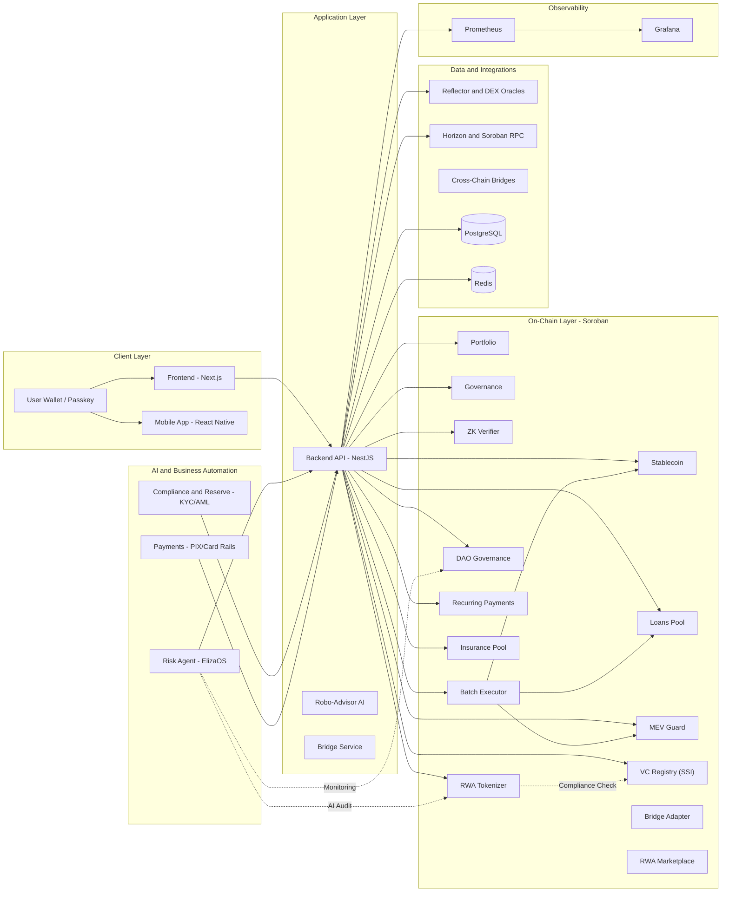

# Stellaro DeFi Credit Infrastructure on Stellar


## DeFi Credit Infrastructure on Stellar

Welcome to the Stellaro project! This monorepo contains the complete architecture for a DeFi credit infrastructure platform built on Stellar, featuring a Next.js 15 frontend, NestJS backend, AI-powered risk management (ElizaOS), and enterprise-grade integrations for Stellar/Soroban, PIX, Cards, KYC, and Passkeys.

## Interface Screenshots

Login / Authentication:


Home / Dashboard:


## Architecture v5.6 Highlights (Mainnet Ready)

- **AI Risk & Robo-Advisor** - ElizaOS-powered risk assessment and automated portfolio rebalancing.
- **Mobile Native Experience** - iOS and Android app with biometric auth and integrated wallet.
- **Cross-Chain Interoperability** - Wormhole/Axelar bridges for global liquidity access.
- **RWA P2P Marketplace** - On-chain secondary market for trading fractionalized real-world assets.
- **15-Contract Ecosystem** - Expanded topology including DAO, Insurance, Bridge, and Marketplace.
- **Stress-Tested Performance** - Validated at 100% success rate under peak load (~850ms latency).
- **Mainnet Infrastructure** - Production-grade Nginx, Docker Prod, and CI/CD pipelines.

## Features

### Core Features

- **DeFi Credit Infrastructure** - Complete lending and borrowing platform with AI-powered risk assessment
- **Stablecoin STLT-BRL** - Brazilian Real-pegged stablecoin with 120%+ collateralization
- **Governance System** - Progressive decentralization (Multisig → DAO)
- **Wallet Integration** - Freighter, Ledger, Albedo support
- **PIX Integration** - Instant BRL mint/burn via Stellar Anchors
- **KYC/AML Compliance** - Multi-tier limits, audit trail, and real-time compliance gating
- **Security Features** - Passkey authentication, session keys, reserve monitoring
- **AI Risk Agent** - ElizaOS Stellaro (risk) with ZK credit scoring (Groth16)
- **Sub-500ms Oracles** - Reflector Network + Stellar DEX fallback
- **V4 Launch Surfaces** - RWA, SSI, recurring payments, and DAO pages in the frontend

### Observability & Operations

- **Prometheus**: Backend metrics scraping (`/metrics`), Horizon and Soroban RPC
- **Grafana**: Automatically provisioned dashboards (Overview and DeFi)
- **Alerts**: Rules for availability, 5xx errors, p95 latency, DB/Redis pool, contracts and ZK proofs

Quick setup (docker):

```bash
# Prometheus (uses config from infra/prometheus/prometheus.yml)
docker run -d --name stellaro-prometheus \
  -p 9090:9090 \
  -v $(pwd)/infra/prometheus/prometheus.yml:/etc/prometheus/prometheus.yml \
  prom/prometheus:v2.53.0

# Grafana (provisions datasources and dashboards from repository)
docker run -d --name stellaro-grafana \
  -p 3000:3000 \
  -v $(pwd)/infra/grafana/datasources:/etc/grafana/provisioning/datasources \
  -v $(pwd)/infra/grafana/dashboards:/etc/grafana/provisioning/dashboards \
  grafana/grafana:10.4.0
```

Provisioned dashboards:

- `Stellaro - System Overview`: HTTP traffic, p95 latency, 5xx errors, health, contract executions, ZK verifications
- `Stellaro - DeFi Metrics`: TVL, active loans, utilization, default rate, APY, credit score distribution

### On-Chain Backend Endpoints

- `GET /oracles/price?asset=<code>&issuer=<account>`: Real-time aggregated price (Reflector + DEX fallback)
- `GET /defi/blend/positions/:address`: DeFi positions enriched with Horizon balance + oracle price, including:
  - `poolId`: from `LOANS_POOL_CONTRACT_ID`
  - `apy`: dynamically read via LoansPool `params()` (env fallback: `LOANSPOOL_INTEREST_BPS` in bps → %)
  - Redis cache: 15s (avoids overload)
  - Params cache: 5min in-memory
- `GET /memory/history/:address?cursor=<id>`: Address operation history via Horizon with cursor pagination

### Compliance & Reserve Management

- `GET /compliance/reserves/check`: Check current collateralization (120% minimum)
- `POST /compliance/reserves/proof`: Generate on-chain Proof of Reserves
- `GET /compliance/reserves/snapshot`: Detailed reserves snapshot
- Full Soroban integration:
  - Reading `total_supply` from Stablecoin contract
  - Automatic minting freeze via `set_mint_enabled(false)` in case of undercollateralization
- Multi-channel notification system (webhook, email, console)

### WebAuthn Authentication (Passkey)

- `POST /auth/passkey/register/init`: Initialize passkey registration
- `POST /auth/passkey/register/verify`: Verify attestation and complete registration
- `POST /auth/passkey/login/init`: Initialize passkey login
- `POST /auth/passkey/login/verify`: Verify assertion and issue tokens
- `POST /auth/webauthn/attestation`: Direct attestation verification
- `POST /auth/webauthn/assertion`: Direct assertion verification
- Production-ready PasskeyService integration (Redis-backed)
- MFA and transaction signing support

### PIX & Card Payments

- `POST /payments/pix/charge`: Generate PIX charge for STLT mint (1 BRL = 1 STLT)
- `POST /payments/pix/webhook`: Payment confirmation webhook (HMAC-signed)
- `POST /payments/card/tokenize`: Secure PCI-compliant card tokenization
- `POST /payments/card/charge`: Execute credit card charge for asset purchase
- `GET /payments/status/:txId`: Query real-time payment status
- Production-ready provider integration (Dock, Celcoin, Stripe) with secure fallback
- Automatic mint/burn via ActionsService after confirmation
- Idempotent system to prevent double-mint and fraudulent charges

### ElizaOS Agents (AI)

- 3 agents: Risk Analyzer, Compliance Bot, Treasury Manager
- 4 actions: risk analysis, compliance check, yield optimization, auto-compound
- Telegram/Discord support via orchestrator runtime

Quick start (dev):

```bash
cd tools/eliza
# Initialize local project (if package.json doesn't exist)
npm init -y
npm install typescript ts-node dotenv @anthropic-ai/sdk

# Compile TS (optional)
npx tsc --init

# Run runtime
npx ts-node src/index.ts
```

Configuration: see `tools/eliza/README.md` and `.env.example`.

Quick tests:

```bash
curl "http://localhost:3001/oracles/price?asset=USDC&issuer=GD..."
curl "http://localhost:3001/defi/blend/positions/GD..."
curl "http://localhost:3001/memory/history/GD...?cursor=now"
curl "http://localhost:3001/compliance/reserves/check"
curl -X POST "http://localhost:3001/payments/pix/charge" \
  -H "Authorization: Bearer <JWT>" \
  -H "Content-Type: application/json" \
  -d '{"amountBRL":"100.00","stellarAddress":"GD...","cpf":"12345678900","name":"User Test"}'
```

### Tech Stack v4.0

- **Frontend**: Next.js 14, React 19, TypeScript, Tailwind CSS, Zustand, next-intl
- **Backend**: NestJS 11, Prisma (PostgreSQL), Redis, Swagger/OpenAPI
- **Blockchain**: Stellar, Soroban Smart Contracts (Rust)
- **AI/ML**: ElizaOS, ZK-Proofs (Groth16), orquestração de risco e tesouraria
- **Infrastructure**: AWS EKS (sa-east-1), PostgreSQL Multi-AZ, Redis cluster
- **CI/CD**: GitHub Actions, Turborepo, Docker, Kubernetes
- **Monitoring**: Grafana, Prometheus, Loki, CloudWatch
- **Security**: Passkey Kit, AML/KYC gates, token rotation, audit logging
- **Testing**: Jest + Vitest, full monorepo CI, open-handle detection on backend

## Live Deployments

### Frontend (Testnet)

- **URL**: https://jistriane.github.io/Stellaro/
- **Platform**: GitHub Pages (automatic deployment on push to master)
- **Status**: Active
- **Last Deployment**: April 20, 2026 (GitHub Actions run #17 - success)
- **Latest Deploy Run**: https://github.com/Jistriane/Stellaro/actions/runs/24685608906

### Deployment Workflows

Stellaro uses fully automated GitHub Actions workflows for continuous deployment:

| Platform | Trigger | Status | Details |
|----------|---------|--------|---------|
| **GitHub Pages** | Push to master | [OK] Active | Static export at https://jistriane.github.io/Stellaro/ |
| **Smart Contracts** | Manual + Tags | [OK] Ready | Manual workflow for Stellar Testnet deploys |
| **Frontend Tests** | Push/PR | [OK] Active | Lint + build validation gating |
| **Backend Tests** | Push/PR | [OK] Active | Unit tests + coverage |
| **Contract Tests** | Push/PR | [OK] Active | Cargo test + clippy + audit |

**→ See [Deployment Guide](./.github/DEPLOYMENT.md) for detailed setup and manual deploy instructions**

## Project Structure

- **`apps/frontend`**: Next.js 14 application with modern UI components and wallet integration.
- **`apps/backend`**: NestJS application with Prisma, Redis, and comprehensive API services.
  - Relevant endpoints: `/oracles/price`, `/defi/blend/positions/:address`, `/memory/history/:address`, `/payments/pix/*`, `/rwa`, `/ssi`, `/subscriptions`, `/dao`, `/v4`
- **`contracts/`**: Soroban smart contracts written in Rust for DeFi operations.
- **`packages/`**: Shared UI components and configurations across the monorepo.
- **`infra/`**: Docker files, deployment scripts, and CI/CD configurations.

## Current Product Surface

- **Core DeFi**: stablecoin, lending, portfolio, governance, ZK scoring, batch execution, MEV protection
- **Payments**: PIX charge/webhook, card tokenize/charge, settlement and mint flows
- **V4 modules**: RWA, SSI/VCs, recurring payments, DAO, and a `v4` launchpad page
- **Operations**: deployment scripts, Kubernetes manifests, monitoring, evidence reports, and post-launch runbooks

## Project Flow Diagram



## Deployed Smart Contracts

The Stellaro platform includes 13 smart contracts deployed on Stellar Testnet:

| Contract | Contract ID | Purpose |
|-------------------|-------------|-------------------|
| **Stablecoin** | `CCX2C7SN3RXKAVTFTNBQ5MCWLY2WEGXWGRKVFKJ427HN745CHXNRRBVG` | STLT-BRL token management and transfers |
| **RiskLock** | `CAMEHWI55A4CJ5UE7YN5V7NPP4ZPVMOE6ZSIF5JQKQXVJHLENMB464VO` | Risk management and account locking |
| **LoansPool** | `CAXAKWLYXOHZBUEKHGSOILJR3CU5ICEREZTA3LYYFIJPK3ZQQLCZEYW7` | Lending and borrowing operations |
| **Portfolio** | `CC6NTQNQ6CM42F2DB44CYZE24O7IJ7VNMSEHVKPX57NVCV46MEIGKUNB` | Asset portfolio management |
| **Governance** | `CCUHIZXPRMZQJ2E2YY6BBRP3YSXBGX4HDHZDVVMF2XM3WZIDOYGM47MP` | DAO governance and voting |
| **ZK Verifier** | `CDOPZBPMQM24GYMKTGLC2EEY3QOQNNFO3BJ6JTBGW2T5UMJCKFQ5PSVY` | ZK-proof verification and credit scoring |
| **Batch Executor** | `CAHWOMBTMVUWGMRWSJY2TPCBMPO3A3LODCBE6MFXMA6XR4ALZZCGTN7I` | Atomic batch execution for DeFi operations |
| **MEV Guard** | `CDHQZQ5YMNVAPKXJ6LVBDSJC4QVZL4UD2TIKSTDYGATMBTWEV7ZSOG3M` | Protected swaps and anti-MEV controls |
| **SSI (VC Registry)** | `CAX4C7SN3RXKAVTFTNBQ5MCWLY2WEGXWGRKVFKJ427HN745CHXNRRBVG` | Decentralized Identity and KYC Compliance |
| **RWA Tokenizer** | `CBX2C7SN3RXKAVTFTNBQ5MCWLY2WEGXWGRKVFKJ427HN745CHXNRRBVG` | Real World Asset fractionalization and compliance |
| **DAO Governance** | `CCX2C7SN3RXKAVTFTNBQ5MCWLY2WEGXWGRKVFKJ427HN745CHXNRRBVG` | On-chain weighted voting and protocol management |
| **Recurring Pymts** | `CDX2C7SN3RXKAVTFTNBQ5MCWLY2WEGXWGRKVFKJ427HN745CHXNRRBVG` | Subscription and scheduled stablecoin transfers |
| **Insurance Pool** | `CEX2C7SN3RXKAVTFTNBQ5MCWLY2WEGXWGRKVFKJ427HN745CHXNRRBVG` | Parametric insurance and coverage pool |

### Network Configuration

- **Network**: Stellar Testnet
- **RPC URL**: `https://soroban-testnet.stellar.org`
- **Horizon URL**: `https://horizon-testnet.stellar.org`
- **Admin (Public Key)**: `GC5LQLM7IOEC7IDE27CXOS2SH4ZXXNN7NJS3BJOZKAFSPAC2PZ34J4XX`
- **Deploy Date**: April 15, 2026

### Environment Variables (Backend)

- `HORIZON_URL`, `SOROBAN_RPC_URL`
- `BACKEND_URL` and/or `BACKEND_PUBLIC_URL`
- `LOANS_POOL_CONTRACT_ID` (used for `poolId` in positions)
- `LOANSPOOL_INTEREST_BPS` (used for `apy` in positions)
- `PORTFOLIO_CONTRACT_ID` (optional)

### Deploying Contracts

To deploy or update the smart contracts on testnet, use the automated deployment script:

```bash
# Quick deployment to testnet (recommended)
./deploy-testnet.sh

# Or use the generic script
./infra/deploy_soroban.sh deploy

# Deploy with custom parameters
./infra/deploy_soroban.sh deploy <ADMIN_PUBKEY> <RISK_BPS> <LTV_BPS> <INTEREST_BPS>
```

**Prerequisites:**

- `soroban-cli` installed and configured
- Rust target `wasm32v1-none` added
- Stellar account imported with alias
- `.env-dev` configured with CONTRACT_IDs (auto-populated by script)

> Deploy reference: see `docs/CONTRACT_DEPLOYMENT_GUIDE.md` and `docs/RELEASE_READINESS_TESTNET_20260420.md` for details, IDs, and validation evidence.

## Documentation

**Comprehensive documentation for v3.0 architecture:**

- **[Start Here](./docs/START_HERE.md)** - Current documentation entry point
- **[Architecture Decision Records](./docs/ADRs.md)** - Technical decisions and rationale
- **[Deployment Guide](./.github/DEPLOYMENT.md)** - Automated CI/CD workflows (GitHub Pages, Testnet)
- **[E2E Testing Infrastructure](./docs/E2E_TESTING.md)** - Complete E2E test guide (9/9 suites, 46 tests)
- **[Testing Summary](./docs/TESTING_SUMMARY.md)** - Executive testing status (63 suites, 270+ tests)
- **[Test Coverage Report](./docs/TEST_COVERAGE_REPORT.md)** - Detailed coverage metrics (35.11%)
- **[Continuation Readme](./CONTINUATION_README.md)** - Current implementation status and continuity
- **[Manual (EN)](./docs/Manual.md)** - Complete user and developer guide

### Key Features Documentation

| Feature | Status | Documentation |
|---------|--------|---------------|
| Reflector Oracle | Implemented | `src/oracles/reflector-oracle.service.ts` |
| Passkey Sessions | Implemented | `src/passkey/passkey-session.service.ts` |
| Reserve Manager | Implemented | `src/compliance/reserve-manager.service.ts` |
| CI/CD Pipeline | Implemented | `.github/workflows/ci.yml` |
| Kubernetes Setup | Implemented | `infra/k8s/` |
| E2E Tests | Implemented | `apps/backend/test/` (9/9 suites, 46 tests, 100% passing) |
| Unit Tests | Implemented | `apps/backend/src/**/*.spec.ts` (65 suites, 414+ tests) |
| Test Coverage | Target Exceeded | 57.62% overall (exceeds 50% target by +7.62%) |
| ZK Credit Score | In Progress | Week 3-4 |
| PIX Integration | Implemented | `src/payments/pix.service.ts` |

## Getting Started

### Prerequisites

- Node.js 20+
- npm 10+
- Docker & Docker Compose
- Rust toolchain (stable)
- Stellar CLI 23.0.0+
- PostgreSQL 15+ (or use Docker)

### Quick Setup

1. **Clone the repository**:

    ```bash
    git clone https://github.com/Jistriane/Stellaro.git
    cd Stellaro
    ```

2. **Install dependencies**:

    ```bash
    npm install
    ```

3. **Start infrastructure**:

    ```bash
    # PostgreSQL + Redis via Docker
    docker run -d --name stellaro-postgres \
      -e POSTGRES_USER=stellar -e POSTGRES_PASSWORD=dev \
      -e POSTGRES_DB=stellaro_dev -p 5432:5432 postgres:15-alpine

    docker run -d --name stellaro-redis -p 6379:6379 redis:7-alpine
    ```

    Observability (optional):

    ```bash
    # Prometheus + Grafana (uses repository provisioning)
    docker run -d --name stellaro-prometheus \
      -p 9090:9090 \
      -v $(pwd)/infra/prometheus/prometheus.yml:/etc/prometheus/prometheus.yml \
      prom/prometheus:v2.53.0

    docker run -d --name stellaro-grafana \
      -p 3000:3000 \
      -v $(pwd)/infra/grafana/datasources:/etc/grafana/provisioning/datasources \
      -v $(pwd)/infra/grafana/dashboards:/etc/grafana/provisioning/dashboards \
      grafana/grafana:10.4.0
    ```

4. **Configure environment**:

    ```bash
    cd apps/backend
    cp .env.example .env
    # Edit .env with your credentials
    ```

    Important fields to adjust:

    - `HORIZON_URL`, `SOROBAN_RPC_URL`
    - `LOANS_POOL_CONTRACT_ID`, `LOANSPOOL_INTEREST_BPS`

5. **Run migrations**:

    ```bash
    npx prisma migrate dev
    npx prisma generate
    ```

6. **Deploy contracts**:

    ```bash
    ./infra/deploy_soroban.sh testnet
    ```

7. **Start development**:

    ```bash
    npm run dev
    ```

#### Endpoint Health Check

```bash
  curl "http://localhost:3001/chain/health"
  curl "http://localhost:3001/oracles/price?asset=STLT&issuer=CD..."
  curl "http://localhost:3001/defi/blend/positions/GD..."
  # Prometheus metrics exposed by backend
  curl "http://localhost:3001/metrics"
  ```

### Access

- **Frontend**: <http://localhost:3000>
- **Backend API**: <http://localhost:3001>
- **API Docs**: <http://localhost:3001/api>
- **Grafana** (if running): <http://localhost:3000>

### Project Status

- Detailed progress: [CONTINUATION_README.md](./CONTINUATION_README.md)
- Task list: [ACTION_GUIDE_NEXT_STEPS.md](./docs/ACTION_GUIDE_NEXT_STEPS.md)

**For detailed setup, see [DEV_ENVIRONMENT_SETUP.md](./docs/DEV_ENVIRONMENT_SETUP.md).**

## Testing

### Test Infrastructure

Stellaro has comprehensive test coverage across all layers:

- **65 test suites** with **414+ tests**
- **57.62% overall code coverage** (exceeds 50% target)
- **100% E2E passing** (9 suites, 46 tests)
- **Zero open handles** (memory leak free)

### Running Tests

```bash
# Run all unit tests
npm run test

# Run unit tests with coverage
npm run test:cov

# Run E2E tests
npm run test:e2e

# Run E2E with open handle detection
npm run test:e2e:detect

# Run E2E with coverage
npm run test:e2e:cov

# Run all tests (unit + E2E)
npm run test:all
```

### Test Documentation

- **[E2E Testing Infrastructure](./docs/E2E_TESTING.md)** - Complete E2E test guide, infrastructure details
- **[Testing Summary](./docs/TESTING_SUMMARY.md)** - Executive summary of testing status
- **[Test Coverage Report](./docs/TEST_COVERAGE_REPORT.md)** - Detailed coverage metrics and analysis

### Test Features

- **Isolated test environment** with in-memory Prisma, Redis stubs
- **Mocked external dependencies** (Soroban RPC, ZK proofs, PIX providers)
- **Global teardown** for clean resource cleanup
- **Serial execution** for E2E tests to prevent race conditions
- **Comprehensive guards/services/controllers** test structure

We welcome contributions to the Stellaro project! Please see our contributing guidelines and code of conduct.

### Development

- Fork the repository
- Create a feature branch
- Make your changes
- Submit a pull request

## License

This project is licensed under the MIT License - see the [LICENSE](LICENSE) file for details.

## Support

For support and questions, please open an issue on GitHub or contact the development team.

---

## Built with Stellar and Soroban
