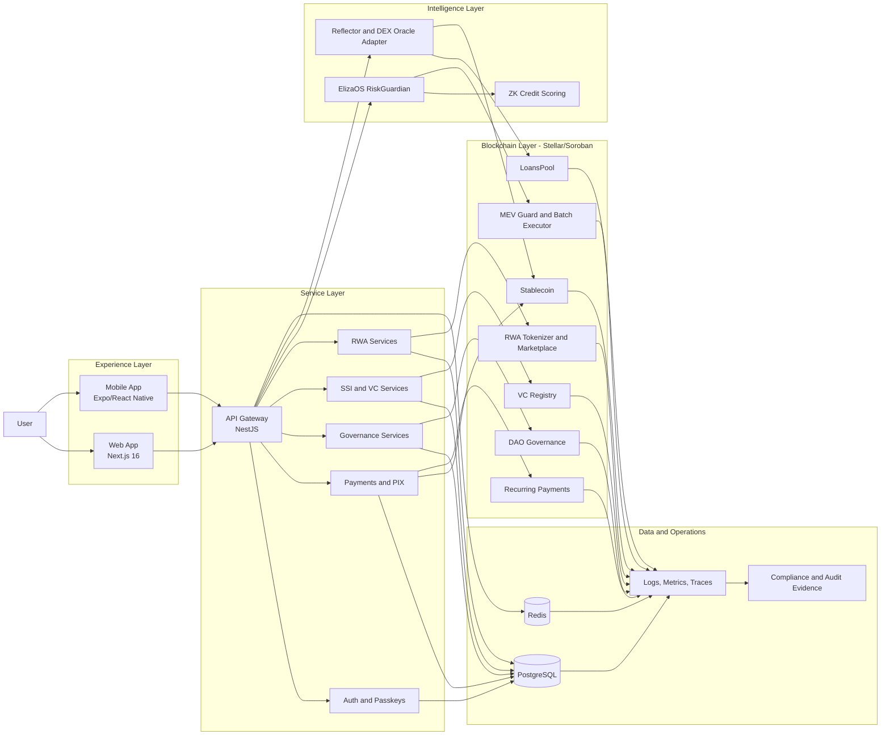

# Stellaro DeFi Credit Infrastructure on Stellar


<p align="center">
	
</p>

<p align="center">
	
</p>

## DeFi Credit Infrastructure on Stellar

Welcome to the Stellaro project. This monorepo contains the complete architecture for a DeFi credit infrastructure platform built on Stellar, featuring a Next.js 16 frontend, NestJS backend, AI-powered risk management (ElizaOS), and enterprise-grade integrations for Stellar/Soroban, PIX, Cards, KYC, and Passkeys.

## Frontend Runtime

- The frontend runs with English as the default runtime locale.
- `next-intl` is configured with a single `en` locale in the current app shell.
- UI copy in the main routes is kept in English to match the runtime configuration.

### TradingView in Development

- By default, local development uses a safe fallback card instead of loading the external TradingView widget.
- This avoids noisy third-party preload/script warnings in dev consoles and automated browser checks.
- To force-enable the real TradingView widget in development, set `NEXT_PUBLIC_ENABLE_TRADINGVIEW_DEV=true` in your local env.
- The variable is documented in [.env.example](.env.example).

## x402 Live Activation (Backend + Frontend)

The base x402 integration is available in the payments module and exposed in the Pix screen.

### 1. Required backend environment variables

Set the following variables in `apps/backend/.env`:

```env
# x402 mode: disabled | stub | live
X402_MODE=live

# Facilitator endpoint
X402_FACILITATOR_URL=https://your-facilitator.example.com

# Contract/provider used by the facilitator for settlement
FACILITATOR_PROVIDER_CONTRACT_ID=CXXXXXXXXXXXXXXXXXXXXXXXXXXXXXXXXXXXXXXXXXXXXXXXXXXXXXXX

# API key expected by the facilitator
FACILITATOR_API_KEY=replace-with-real-key

# Optional tuning
X402_NETWORK=stellar:testnet
X402_ACCEPTED_ASSET=STLT
X402_RESOURCE=/payments/x402/settle
X402_RECIPIENT=GC5LQLM7IOEC7IDE27CXOS2SH4ZXXNN7NJS3BJOZKAFSPAC2PZ34J4XX
X402_FEE_BPS=25
X402_TTL_SECONDS=900
```

### 2. Frontend API URL

Set in `apps/frontend/.env.local`:

```env
NEXT_PUBLIC_API_URL=http://localhost:3001
```

### 3. Run local services

```bash
docker compose up -d postgres redis
```

Then start backend and frontend in separate terminals:

```bash
cd apps/backend && npm run dev
cd apps/frontend && npm run dev
```

### 4. Verify integration

Status endpoint:

```bash
curl -s http://localhost:3001/payments/x402/status
```

Sample quote:

```bash
curl -s -X POST http://localhost:3001/payments/x402/quote \
	-H 'Content-Type: application/json' \
	-d '{"amount":"25.00","asset":"STLT","intent":"deposit","memo":"stellaro:deposit"}'
```

Expected behavior:

- `mode=stub` when live credentials are incomplete.
- `mode=live` when all facilitator credentials are configured.
- Pix page shows **x402 Settlement Rail** and can generate quote payloads for facilitator handoff.

## Etherfuse Activation (Backend + Frontend)

The base Etherfuse integration is available in the payments module and exposed in the Pix screen.

### 1. Required backend environment variables

Set the following variables in `apps/backend/.env`:

```env
# etherfuse mode: disabled | stub | live
ETHERFUSE_MODE=stub

# Sandbox or production API base
ETHERFUSE_API_BASE_URL=https://api.sand.etherfuse.com

# API key must be passed as raw Authorization header (no Bearer prefix)
ETHERFUSE_API_KEY=replace-with-real-key

# Required for live quote creation in this integration
ETHERFUSE_CUSTOMER_ID=xxxxxxxx-xxxx-xxxx-xxxx-xxxxxxxxxxxx

# Optional defaults used by the quote endpoint
ETHERFUSE_BLOCKCHAIN=stellar
ETHERFUSE_DEFAULT_QUOTE_TYPE=onramp
ETHERFUSE_SOURCE_ASSET=MXN
ETHERFUSE_TARGET_ASSET=USDC:GA5ZSEJYB37JRC5AVCIA5MOP4RHTM335X2KGX3IHOJAPP5RE34K4KZVN
ETHERFUSE_WALLET_ADDRESS=GXXXXXXXXXXXXXXXXXXXXXXXXXXXXXXXXXXXXXXXXXXXXXXXXXXXXXXX

# Optional stub tuning for local demos
ETHERFUSE_STUB_EXCHANGE_RATE=0.19
ETHERFUSE_STUB_FEE_BPS=35
```

### 2. Verify integration

Status endpoint:

```bash
curl -s http://localhost:3001/payments/etherfuse/status
```

Sample quote:

```bash
curl -s -X POST http://localhost:3001/payments/etherfuse/quote \
	-H 'Content-Type: application/json' \
	-d '{"amount":"150","quoteType":"onramp"}'
```

Expected behavior:

- `mode=stub` without live API credentials.
- `mode=live` when `ETHERFUSE_API_BASE_URL` + `ETHERFUSE_API_KEY` are configured.
- Pix page shows **Etherfuse FX Rail** and can generate onramp/offramp quote payloads.

## Architecture Highlights

- **Digital Sovereignty** --- Full handover to the DAO and decentralized control. [██████████] 100%
- **Liquid Staking (sXLM)** --- Native Lumen staking to maximize community yield. [██████████] 100%
- **Institutional Vaults** --- Segregated vaults with enterprise compliance and whitelisting. [██████████] 100%
- **Global Liquidity Hub** --- Institutional routing for large volume orders ($1M+). [██████████] 100%
- **AI Tax Reporting** --- Automated global tax compliance assisted by AI. [██████████] 100%
- **Referral System On-chain** --- On-chain referral program with rewards and fee discounts. [██████████] 100%
- **RWA Lifecycle 2.0** --- Full real-world asset cycle with auctions and per-asset governance. [██████████] 100%
- **Validated Performance** --- Successful institutional stress tests with optimized latency. [██████████] 100%

## Core Features

- **DeFi Credit Infrastructure:** Complete lending and borrowing platform with AI-powered risk assessment.
- **Stablecoin STLT-BRL:** Brazilian Real-pegged stablecoin with 120%+ collateralization.
- **Governance System:** Progressive decentralization (Multisig to DAO).
- **Wallet Integration:** Freighter, Ledger, Albedo support.
- **PIX Integration:** Instant BRL mint/burn via Stellar Anchors.
- **KYC/AML Compliance:** Multi-tier limits, audit trail, and real-time compliance gating.
- **Security Features:** Passkey authentication, session keys, reserve monitoring.
- **AI Risk Agent:** ElizaOS RiskGuardian with ZK credit scoring (Groth16).
- **Sub-500ms Oracles:** Reflector Network + Stellar DEX fallback.

## Project Flow Diagram



## Deployment Registry and Explorer Links

### Testnet V5 Manifest

| Contract | Contract ID | Stellar Expert |
| :--- | :--- | :--- |
| **Recurring Payments** | `CCD4OHCNA27Z7FUDAA3YSSYCOZE2ZI4ZWSR6QC363LOMWUCFJDNZT7ED` | https://stellar.expert/explorer/testnet/contract/CCD4OHCNA27Z7FUDAA3YSSYCOZE2ZI4ZWSR6QC363LOMWUCFJDNZT7ED |
| **DAO Governance** | `CDJ7KQDEROW7TH4YYTSHVV7KKMDWMDOBS76UENIP6N4JPYQCD4YR37QW` | https://stellar.expert/explorer/testnet/contract/CDJ7KQDEROW7TH4YYTSHVV7KKMDWMDOBS76UENIP6N4JPYQCD4YR37QW |
| **Institutional Vault** | `CA2VG7TADA2JQQICK43Q33XYF5T6YMHUTM3CMKKGUJV5HFVTGCNQCWAH` | https://stellar.expert/explorer/testnet/contract/CA2VG7TADA2JQQICK43Q33XYF5T6YMHUTM3CMKKGUJV5HFVTGCNQCWAH |
| **Insurance Pool** | `CCIX35HUAEROVZR6WI76YB5IPDD3SN4EQFGWFHL4ZSO6FOKNNYJWI6XS` | https://stellar.expert/explorer/testnet/contract/CCIX35HUAEROVZR6WI76YB5IPDD3SN4EQFGWFHL4ZSO6FOKNNYJWI6XS |

### Testnet Deployment Snapshot (2026-04-15)

Source: `docs/CONTRACT_DEPLOYMENT_GUIDE.md`.

| Contract | Env Key | Contract ID | Stellar Expert |
| :--- | :--- | :--- | :--- |
| Stablecoin | `STABLECOIN_CONTRACT_ID` | `CCX2C7SN3RXKAVTFTNBQ5MCWLY2WEGXWGRKVFKJ427HN745CHXNRRBVG` | https://stellar.expert/explorer/testnet/contract/CCX2C7SN3RXKAVTFTNBQ5MCWLY2WEGXWGRKVFKJ427HN745CHXNRRBVG |
| RiskLock | `RISKLOCK_CONTRACT_ID` | `CAMEHWI55A4CJ5UE7YN5V7NPP4ZPVMOE6ZSIF5JQKQXVJHLENMB464VO` | https://stellar.expert/explorer/testnet/contract/CAMEHWI55A4CJ5UE7YN5V7NPP4ZPVMOE6ZSIF5JQKQXVJHLENMB464VO |
| LoansPool | `LOANSPOOL_CONTRACT_ID` | `CAXAKWLYXOHZBUEKHGSOILJR3CU5ICEREZTA3LYYFIJPK3ZQQLCZEYW7` | https://stellar.expert/explorer/testnet/contract/CAXAKWLYXOHZBUEKHGSOILJR3CU5ICEREZTA3LYYFIJPK3ZQQLCZEYW7 |
| Portfolio | `PORTFOLIO_CONTRACT_ID` | `CC6NTQNQ6CM42F2DB44CYZE24O7IJ7VNMSEHVKPX57NVCV46MEIGKUNB` | https://stellar.expert/explorer/testnet/contract/CC6NTQNQ6CM42F2DB44CYZE24O7IJ7VNMSEHVKPX57NVCV46MEIGKUNB |
| Governance | `GOVERNANCE_CONTRACT_ID` | `CCUHIZXPRMZQJ2E2YY6BBRP3YSXBGX4HDHZDVVMF2XM3WZIDOYGM47MP` | https://stellar.expert/explorer/testnet/contract/CCUHIZXPRMZQJ2E2YY6BBRP3YSXBGX4HDHZDVVMF2XM3WZIDOYGM47MP |
| ZK Verifier | `ZK_VERIFIER_CONTRACT_ID` | `CDOPZBPMQM24GYMKTGLC2EEY3QOQNNFO3BJ6JTBGW2T5UMJCKFQ5PSVY` | https://stellar.expert/explorer/testnet/contract/CDOPZBPMQM24GYMKTGLC2EEY3QOQNNFO3BJ6JTBGW2T5UMJCKFQ5PSVY |
| Batch Executor | `BATCH_EXECUTOR_CONTRACT_ID` | `CAHWOMBTMVUWGMRWSJY2TPCBMPO3A3LODCBE6MFXMA6XR4ALZZCGTN7I` | https://stellar.expert/explorer/testnet/contract/CAHWOMBTMVUWGMRWSJY2TPCBMPO3A3LODCBE6MFXMA6XR4ALZZCGTN7I |
| MEV Guard | `MEV_GUARD_CONTRACT_ID` | `CDHQZQ5YMNVAPKXJ6LVBDSJC4QVZL4UD2TIKSTDYGATMBTWEV7ZSOG3M` | https://stellar.expert/explorer/testnet/contract/CDHQZQ5YMNVAPKXJ6LVBDSJC4QVZL4UD2TIKSTDYGATMBTWEV7ZSOG3M |

### Strict Testnet Validation Snapshot (2026-04-20)

Source: `contracts/reports/20260420_rc_strict/evidence_report.md`.

| Contract | Contract ID | Stellar Expert |
| :--- | :--- | :--- |
| Stablecoin | `CAB2HQ7XQ2CS4ROO4E3PZVJASXUNEKWTDFGRRGIPVUFHGQC24HKZHJIZ` | https://stellar.expert/explorer/testnet/contract/CAB2HQ7XQ2CS4ROO4E3PZVJASXUNEKWTDFGRRGIPVUFHGQC24HKZHJIZ |
| Batch Executor | `CDZZQYUKOSTHDOUCU273NHRVYJ67A37JC5SL3JAOJ77FUT4KGQXSJBUI` | https://stellar.expert/explorer/testnet/contract/CDZZQYUKOSTHDOUCU273NHRVYJ67A37JC5SL3JAOJ77FUT4KGQXSJBUI |
| MEV Guard | `CAHZYMMJVZN4JESEXMCVVOVTOE3A5AISNK3IWTZRDBXW3ZK2ZKBFSFHD` | https://stellar.expert/explorer/testnet/contract/CAHZYMMJVZN4JESEXMCVVOVTOE3A5AISNK3IWTZRDBXW3ZK2ZKBFSFHD |

Key strict-validation transaction traces (Stellar Expert):

- Smoke mutation tx: https://stellar.expert/explorer/testnet/tx/a7a88dbe70af63708eb6840cec8de7e822e8c4c80ac41627599213c120b7461f
- Transactional E2E tx #1: https://stellar.expert/explorer/testnet/tx/8fe04c0a733ea57c5093fc7c52f0c4251201a2e3a4b21c9e72f2bcfe26f4136e
- Transactional E2E tx #2: https://stellar.expert/explorer/testnet/tx/11409e21b411b02c39812a403a0a946b72629358787b2702c594a4c9ffd8990b
- Transactional E2E tx #3: https://stellar.expert/explorer/testnet/tx/efff48f37f2c6dc93d11e0498e0d422c5ded8ce2b6720009543be9366774f07b
- Transactional E2E tx #4: https://stellar.expert/explorer/testnet/tx/38813333d1ec1f2b216d00fa7d30b348c1d3e9bb7471863aa6e2a24eea5930cc
- Transactional E2E tx #5: https://stellar.expert/explorer/testnet/tx/a899d6a0f0f08840eeb83a7fc7a0537f4c0a092db6596f91752f78254587c5c7

### Latest Operational Evidence Bundle (2026-04-25)

Source: `contracts/reports/20260425_104952/evidence_report.md`.

- Network: testnet
- Source address: `GC5LQLM7IOEC7IDE27CXOS2SH4ZXXNN7NJS3BJOZKAFSPAC2PZ34J4XX`
- Git commit in bundle: `c941ed6a`
- Bundle Contract ID (Stablecoin): `CCX2C7SN3RXKAVTFTNBQ5MCWLY2WEGXWGRKVFKJ427HN745CHXNRRBVG`
- Bundle Contract ID (Batch Executor): `CDZZQYUKOSTHDOUCU273NHRVYJ67A37JC5SL3JAOJ77FUT4KGQXSJBUI`
- Bundle Contract ID (MEV Guard): `CAHZYMMJVZN4JESEXMCVVOVTOE3A5AISNK3IWTZRDBXW3ZK2ZKBFSFHD`

### Mainnet Status

- Mainnet deployment is documented as operationally successful in `docs/MAINNET_DEPLOYMENT_RESULT.md`.
- Public mainnet contract IDs are not currently listed in the repository root README.
- Release governance reference: `docs/MAINNET_DEPLOYMENT_RESULT.md`
- Release readiness reference: `docs/MAINNET_CHECKLIST_COMPLETE.md`
- Mainnet onboarding reference: `docs/MAINNET_ONBOARDING_GUIDE.md`

**Primary admin/source account (testnet evidence and snapshots):** `GC5LQLM7IOEC7IDE27CXOS2SH4ZXXNN7NJS3BJOZKAFSPAC2PZ34J4XX`

## Technical Documentation

For detailed information, please refer to:

- [Full Technical Architecture](STELLARO ARQUITETURA TÉCNICA COMPLETA.md)
- [Technical and Regulatory Architecture](STELLARO ARQUITETURA TÉCNICA E REGULATÓRIA.md)
- [Security Audit Report](SECURITY_AUDIT_REPORT.md)
- [Project Expansion Walkthrough](walkthrough.md)

---
Stellaro V5 Protocol.
